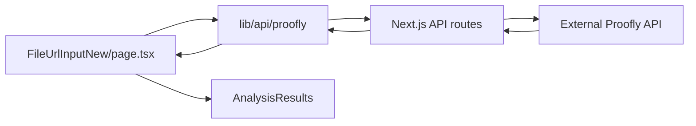

# How It Works

This document explains the architecture, data flow, and key components of the Proofly Checker project.

## 1. Overview
Proofly Checker is a Next.js + TypeScript web app that lets users upload images (file or URL), analyzes them for deepfakes via the Proofly API, and displays detailed results with real-time status and optional PDF report generation.

## 2. Project Structure
```
/ (root)
├─ app/
│  ├─ api/proofly/          # Next.js API routes (proxy to Proofly API)
│  │  ├─ upload/route.ts
│  │  ├─ upload-url/route.ts
│  │  ├─ session/[uuid]/route.ts
│  │  ├─ session/[uuid]/status/route.ts
│  │  ├─ session/[uuid]/original-image/route.ts
│  │  ├─ session/[uuid]/face/[index]/route.ts
│  │  ├─ status/route.ts
│  │  └─ generate-pdf/[uuid]/route.ts
│  ├─ layout.tsx           # Global layout
│  └─ page.tsx             # Main client view (upload & results)
├─ components/
│  ├─ proofly/             # Domain components
│  │  ├─ FileUrlInputNew.tsx  # Upload UI & polling
│  │  ├─ AnalysisResults.tsx  # Results display
│  │  ├─ ApiLogs.tsx          # Live API logs
│  │  ├─ LoadingProgress.tsx
│  │  ├─ ErrorDisplay.tsx
│  │  └─ ImageUploader.tsx    # (legacy)
│  └─ ui/                  # shadcn/ui primitives (Button, Input, Tabs...)
├─ lib/
│  ├─ api/proofly.ts       # prooflyApi client wrapper + logging
│  ├─ types/proofly.ts     # TS interfaces & formatAnalysisResults()
│  └─ utils/               # Helpers (pdfExport, formatFileSize, cn...)
├─ public/                 # Static assets (favicon, etc.)
├─ next.config.*,
├─ tsconfig.json,
├─ package.json,
└─ README.md
```

## 3. API Routes (`app/api/proofly`)
Each route proxies requests to the external Proofly API to avoid CORS issues:

- **POST /api/proofly/upload**: accepts multipart form file, streams to Proofly `/upload`, returns `{ uuid }`.
- **POST /api/proofly/upload-url**: accepts JSON `{ url }`, downloads image, forwards as file to `/upload`, returns `{ uuid }`.
- **GET /api/proofly/session/[uuid]**: fetches session info (`SessionInfoResponse`).
- **GET /api/proofly/session/[uuid]/status**: fetches status (`SessionStatusResponse`).
- **GET /api/proofly/session/[uuid]/original-image**: proxies raw image bytes.
- **GET /api/proofly/session/[uuid]/face/[index]**: proxies individual face crop.
- **GET /api/proofly/status**: checks overall system health.
- **GET /api/proofly/generate-pdf/[uuid]**: retrieves session info, calls `exportResultsToPDF()`, returns success or error JSON.

## 4. Client API Wrapper (`lib/api/proofly.ts`)
`prooflyApi` exposes methods that call the above routes via `axios`, and logs each call in `apiLogs[]`:
- `uploadImage(file: File)`
- `uploadUrl(url: string)`
- `getSessionStatus(uuid)`
- `getSessionInfo(uuid)`
- `getOriginalImageUrl(uuid)` & `getFaceImageUrl(uuid, index)` (return local proxy URLs)

Error details are extracted for user-friendly messages.

## 5. Data Types & Formatting (`lib/types/proofly.ts`)
- **Interfaces**: `FileUploadResponse`, `SessionStatusResponse`, `SessionInfoResponse`, `FaceInfo`, `ModelResults`, etc.
- **`formatAnalysisResults(sessionInfo)`**: transforms raw `faces[]` into `AnalysisResult[]` with:
  - `faceIndex`, `facePath`
  - `ensembleProbability` (real/fake)
  - `modelProbabilities[]` (per-model real/fake probabilities)
  - `verdict` (text, e.g. "Likely Real", "Likely Deepfake")

## 6. Utilities (`lib/utils`)
- **PDF Export**: `exportResultsToPDF(sessionInfo)` builds a PDF report via `jsPDF`.
- **`formatFileSize(size)`**: human-readable file sizes.
- **`cn()`**: Tailwind classnames helper.

## 7. UI Components (`components/proofly`)
- **FileUrlInputNew**: Tabbed UI for file vs URL input, drag-drop support, preview thumbnails, display modes. On submit, calls `prooflyApi`, toggles `isUploading` / `isProcessing`, polls status, then invokes `onAnalysisComplete`.
- **ApiLogs**: Renders the last 100 API calls in a sidebar.
- **AnalysisResults**: Renders face thumbnails, progress bars, model tables, and confidence charts.
- **LoadingProgress**, **ErrorDisplay**: feedback during upload/processing/errors.

## 8. Page & Layout (`app/page.tsx` & `app/layout.tsx`)
- **layout.tsx**: wraps children with global CSS, metadata, and fonts.
- **page.tsx**: maintains `currentStage` state (`initial` → `uploading` → `processing` → `results`/`error`). Uses Framer-Motion for transitions between:
  1. **FileUrlInputNew** (initial)
  2. **AnalysisResults** + "Upload new image" button (results)
  3. Always includes **ApiLogs** and **Footer**.

## 9. Data Flow Summary


## 10. Running & Deployment
1. **Env var**: `API_BASE_URL=https://api.proofly.ai/api`
2. **Development**: `npm install && npm run dev` → http://localhost:3000
3. **Production**: `npm run build && npm start`
4. **Vercel**: connect repo, set env var, use Next.js preset, build `.next`.

---
For deeper exploration, refer to individual files in `app/api/proofly`, `lib/`, and `components/`. Feel free to file issues or contribute enhancements!
